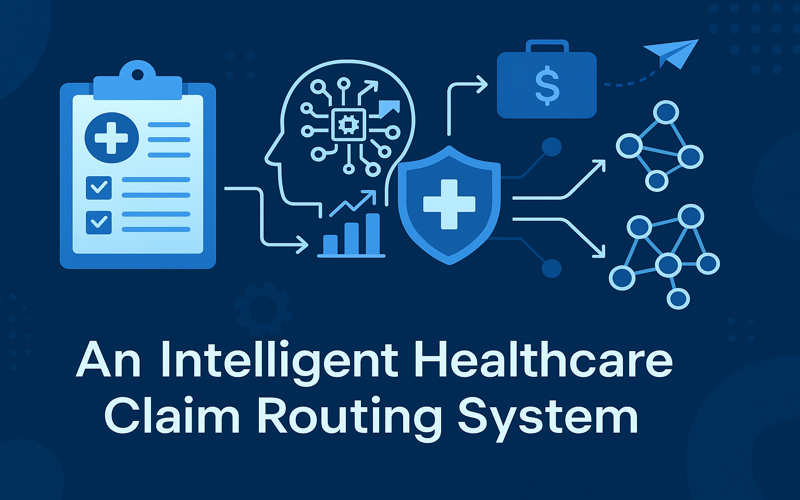
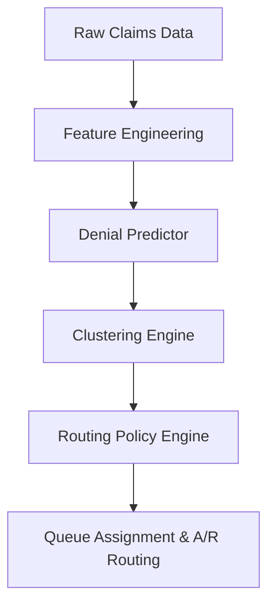

# ClaimFlowEngine

<p style="text-align: center;">
  
</p>


> An Intelligent Healthcare Claim Routing System using ML, Clustering, and RL-style Policies

ClaimFlowEngine is an AI-powered orchestration system that predicts healthcare claim denials, clusters their root causes, and intelligently routes high-complexity A/R claims to the right resolution team. It aims to optimize revenue recovery, reduce rework, and align operational workflows using machine learning and reinforcement learning-inspired policies.

---

## 📌 Project Highlights

- 🔍 **Denial Prediction** using XGBoost on structured EHR and claims data (CPT, ICD-10, payer, etc.)
- 🧠 **Root Cause Clustering** with Sentence-BERT embeddings and HDBSCAN to uncover latent denial drivers
- 🚦 **Routing Engine** with RL-style policy logic to prioritize and assign claims to skilled teams
- ⚙️ **End-to-End Pipeline** with modular components and orchestration (Vertex AI / Airflow ready)

---

## 🧠 System Architecture



---

## 🛠 Tech Stack

| Layer              | Tools & Frameworks                                                  |
|-------------------|----------------------------------------------------------------------|
| ML Models          | XGBoost, Scikit-learn, PyTorch, Sentence-BERT                        |
| RL Logic           | Contextual Bandits, Q-Learning (offline), Reward Function Modeling   |
| Orchestration      | Vertex AI Pipelines, Airflow, FastAPI                                |
| Deployment & Infra | Docker, GitHub Actions, MLflow, GCP / AWS                            |
| Data Sources       | Simulated EHR + Claims Data (837/835), Team Skill Matrix             |

---

## 📁 Directory Structure

```
ClaimFlowEngine/
├── data/                   # Synthetic & real claims datasets
├── models/                 # Trained models & checkpoints
├── routing_policy/         # RL-style decision logic
├── cluster_analysis/       # Unsupervised root cause logic
├── app/                    # FastAPI microservice for integration
├── notebooks/              # Prototyping and EDA
├── tests/                  # Unit & integration tests
└── README.md               # Project documentation
```

---

## 🚀 Getting Started

1. **Install dependencies**

```bash
pip install -r requirements.txt
```

2. **Train Denial Predictor**

```bash
python models/train_denial_predictor.py --config configs/xgboost.yaml
```

3. **Cluster Root Causes**

```bash
python cluster_analysis/cluster_root_causes.py --input data/denied_claims.csv
```

4. **Run Routing Engine**

```bash
uvicorn app.main:app --reload
```

---

## 📈 Outcomes (Simulated)

- 🚀 20% faster resolution for high-priority claims
- 🎯 85% precision in top-3 denial prediction
- 🧩 Denial clusters labeled with ~90% interpretability
- 🤖 RL-routing led to 15% uplift in appeal success rate

---

## 🔬 Future Directions

- Live data integration with EHR APIs for real-time claim processing.
- Human-in-the-loop (HITL) feedback mechanism for continuous policy tuning and improvement.
- Interactive dashboard for enhanced explainability of predictions, cluster insights, and audit trails of routing decisions.
---

## 👩‍💻 Author

**Shilpa Musale** – [LinkedIn](https://www.linkedin.com/in/shilpamusale) • [GitHub](https://github.com/ishi3012) • [Portfolio](https://ishi3012.github.io/ishi-ai/)

---

## 📄 License

This project is licensed under the [MIT License](LICENSE).

