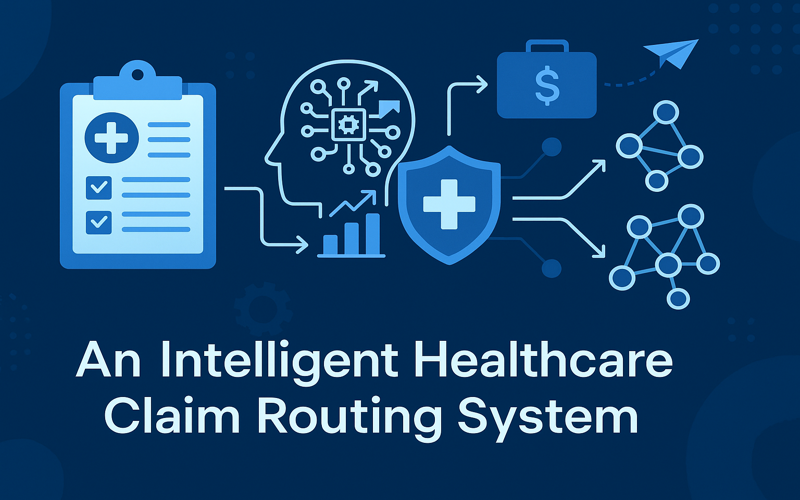

# ClaimFlowEngine

> An Agentic AI System for Smart Healthcare Claim Denial Prediction and Routing

<p align="center">
  
</p>

ClaimFlowEngine is a modular, agentic AI system designed to predict claim denials, analyze root causes, and intelligently route high-complexity A/R claims to resolution teams. It integrates machine learning, unsupervised clustering, and reinforcement learning-inspired logic to automate and optimize revenue cycle workflows in healthcare.

---

## 🚀 MVP Features

- 🔍 **Denial Prediction** with XGBoost on structured claims and EHR metadata
- 🧠 **Root Cause Clustering** using Sentence-BERT embeddings + HDBSCAN
- 🧭 **Routing Engine** with RL-style policy logic to assign claims to optimal queues
- ⚙️ **Vertex AI-Ready Pipelines** for scalable training, inference, and routing
- 🧩 **Agent-Oriented Architecture** enabling composable reasoning units

---

## 🧠 System Architecture
<pre>
```mermaid
flowchart TD
    A[Raw / Synthetic Claims Data] --> B[ML Feature Engineering]
    B --> C[Denial Prediction (XGBoost)]
    C --> D[Root Cause Clustering (S-BERT + HDBSCAN)]
    D --> E[RL Routing Policy Engine]
    E --> F[FastAPI Endpoint / Agent Execution]
```
</pre>
### 🧠 Why Agentic Architecture?

ClaimFlowEngine is built using a modular, **agentic AI architecture** — leveraging Google’s Agent Development Kit (ADK) to enable intelligent decision-making across denial prediction, root cause clustering, and smart workflow routing.

#### 🔍 What This Enables:
- **Tool-augmented reasoning**: Agents can sequentially invoke ML tools — `predictor → cluster → router` — based on context, with logic chaining (e.g., skip clustering if claim isn't denied).
- **Dynamic decision workflows**: Move beyond static APIs by enabling adaptable logic (e.g., escalate edge cases, defer to human-in-the-loop).
- **Scalable modularity**: New tools like “Appeal Generator” or “Payer Policy Retriever” can be plugged in with minimal changes to core logic.
- **Production readiness**: ADK traces each invocation with inputs, outputs, and time-to-resolution — supporting auditability, debuggability, and feedback loops.

> 📈 Why It Matters: In real-world RCM environments, healthcare workflows aren't linear. Agentic architecture brings AI closer to **how operations teams actually think** — with dynamic branching, reasoning, and escalation.

This dual-interface design (REST + Agent) helps the platform scale across:
- Internal integrations (FastAPI endpoints)
- Intelligent assistants (LLM + Tool agents)
- Enterprise-grade orchestration (Vertex Pipelines + ADK agents)

---

## 🛠 Tech Stack

| Layer              | Tools & Frameworks                                                  |
|-------------------|----------------------------------------------------------------------|
| ML Models          | XGBoost, Scikit-learn, PyTorch, Sentence-BERT                        |
| RL Logic           | Contextual Bandits, Q-Learning (offline), Reward Function Modeling   |
| Orchestration      | Vertex AI Pipelines, Airflow, FastAPI                                |
| Deployment & Infra | Vertex AI, Docker, GCP, MLflow, GitHub Actions                       |
|Serving             | FastAPI, REST APIs, GCP Endpoints
| Data Sources       | Simulated EHR + Claims Data (EDI 837), Team Skill Matrix             |

---

## 📁 Directory Structure

```
ClaimFlowEngine/
├── claimflowengine/ # Core logic: agents, pipelines, preprocessing, utils, workflows
│ ├── agents/ # Agent logic for decision routing and appeals
│ ├── pipelines/ # Model training, evaluation, and composite scoring logic
│ ├── preprocessing/ # Feature engineering, imputers, encoders, datetime transforms
│ ├── skills/ # Legacy logic (can migrate to pipelines or agents)
│ ├── utils/ # Shared utilities like config loading and path management
│ └── workflows/ # Agent task chains or pipeline orchestrations
├── data/ # Raw and processed claims dataset
├── models/ # Trained model binaries and benchmark results
├── deployment/
│ ├── pipelines/ # Vertex AI pipeline components & orchestrators
│ ├── serving/ # FastAPI app or custom prediction containers
│ ├── docker/ # Dockerfiles and startup configs
│ ├── config/ # Pipeline & model YAML configs
│ └── gcloud_scripts/ # CLI scripts for pipeline submission, deploy, etc.
├── notebooks/ # EDA, experiments, embedding analysis
├── tests/ # Unit & integration tests
├── requirements.txt
├── setup.py
├── README.md
└── LICENSE
```

---
### Preprocessing Module

All preprocessing logic (imputation, date transformation, feature typing, sklearn pipelines) is modularized in `claimflowengine/preprocessing`. These functions are tested in `tests/test_features.py`.

---

## 📊 Dataset: Synthetic Healthcare Claims

We use [Synthea](https://github.com/synthetichealth/synthea), an open-source synthetic patient generator, to simulate realistic healthcare encounters, procedures, and payer interactions. The data includes:

| Field            | Description                                      |
|------------------|--------------------------------------------------|
| `claim_id`       | Unique ID for the generated claim                |
| `patient_id`     | Synthetic patient identifier                     |
| `patient_age`    | Age of the patient at time of service            |
| `patient_gender` | Biological gender                                |
| `cpt_code`       | Procedure code used to bill                      |
| `icd10_code`     | Primary diagnosis code                           |
| `payer`          | Insurance provider assigned                      |
| `billed_amount`  | Simulated charge submitted                       |
| `denial_flag`    | Binary label (1 = denied, 0 = approved)          |
| `denial_reason`  | Optional categorical reason for denial (if any)  |

We augment `synthea` output with denial labels and reasons for supervised ML training. The final ML-ready dataset is stored at:

```
data/sample_claims.csv
```

> 📎 All data is fully synthetic and does not contain any real patient information. This ensures compliance with HIPAA and IRB constraints.


## 🚀 Getting Started

1. **Install dependencies**

```bash
pip install -r requirements.txt
```

2. **Train Denial Predictor**

```bash
python claimflowengine/skills/train_denial_predictor.py --config deployment/config/xgboost.yaml
```

3. **Cluster Root Causes**

```bash
python claimflowengine/skills/cluster_root_causes.py --input data/denied_claims.csv

```

4. **Run Routing Engine**

```bash
uvicorn deployment/serving/main:app --reload
```

<!-- ---

## 📈 Outcomes (Simulated)

- 🚀 20% faster resolution for high-priority claims
- 🎯 85% precision in top-3 denial prediction
- 🧩 Denial clusters labeled with ~90% interpretability
- 🤖 RL-routing led to 15% uplift in appeal success rate

--- -->

## 🔬 Future Directions

### Domain features:
- Live data integration with EHR APIs for real-time claim processing.
- Human-in-the-loop (HITL) feedback mechanism for continuous policy tuning and improvement.
- Interactive dashboard for enhanced explainability of predictions, cluster insights, and audit trails of routing decisions.
- Agentic AI logic for denial appeals and policy optimization.

### Tech Enhancements:

- LangChain/CrewAI orchestration for multi-agent workflows
- Vertex AI Workbench for low-code experimentation
---

## 👩‍💻 Author

**Shilpa Musale** – [LinkedIn](https://www.linkedin.com/in/shilpamusale) • [GitHub](https://github.com/ishi3012) • [Portfolio](https://ishi3012.github.io/ishi-ai/)

---

## 📄 License

This project is licensed under the [MIT License](LICENSE).
